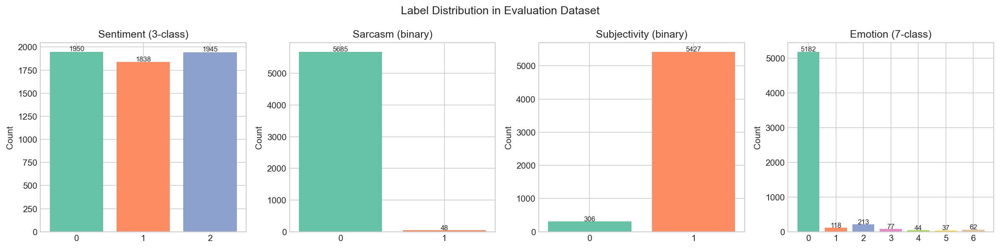
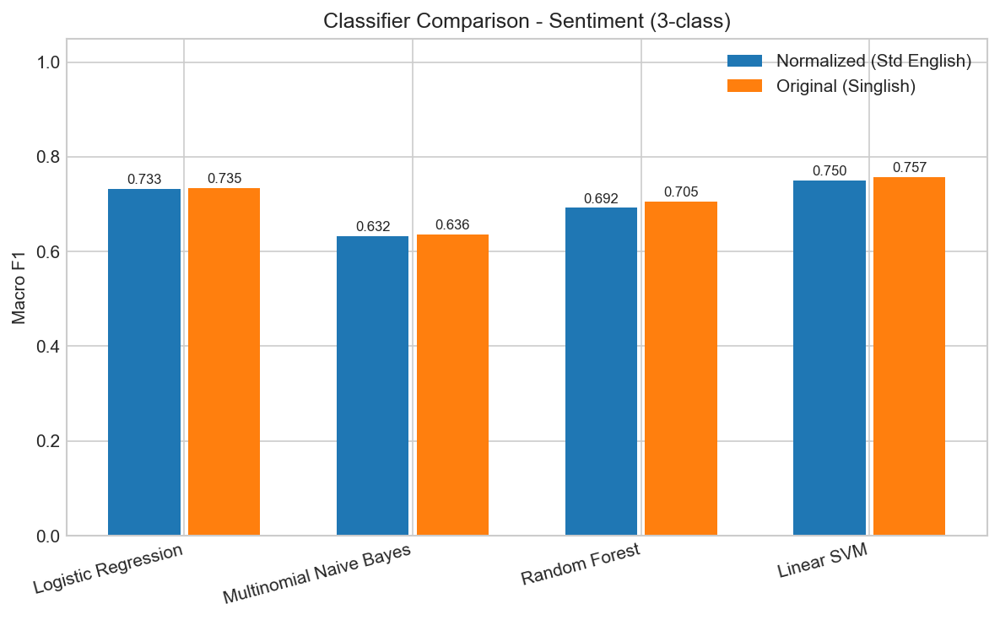
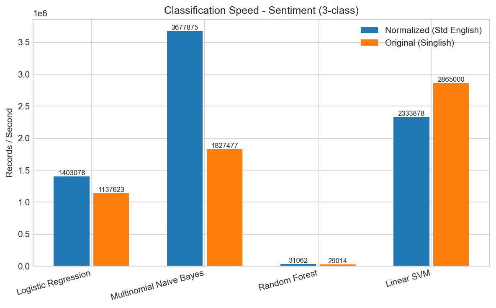
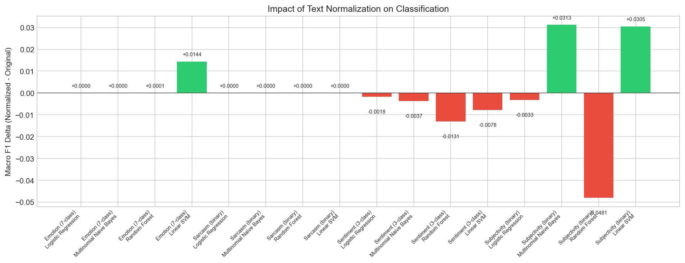
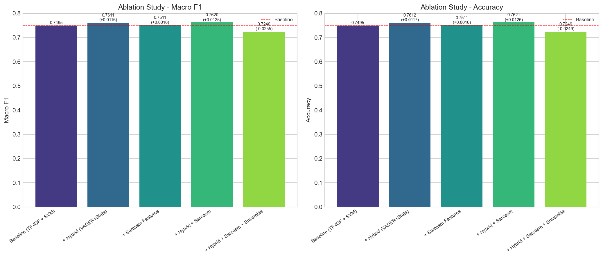
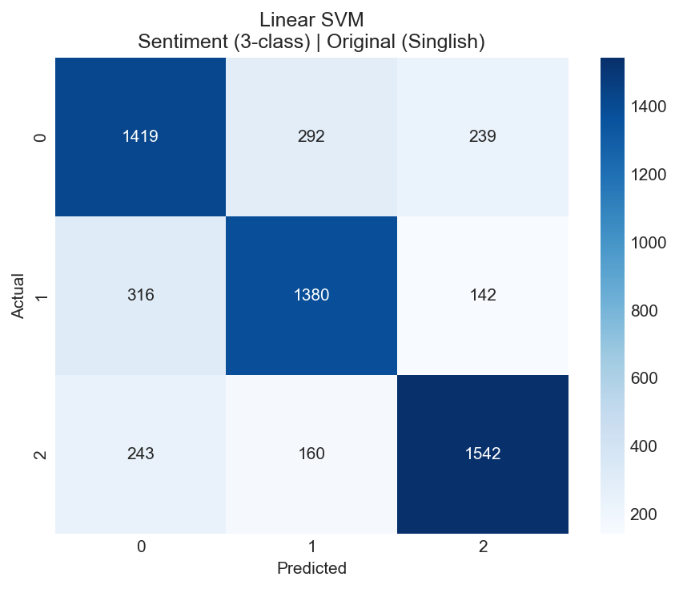
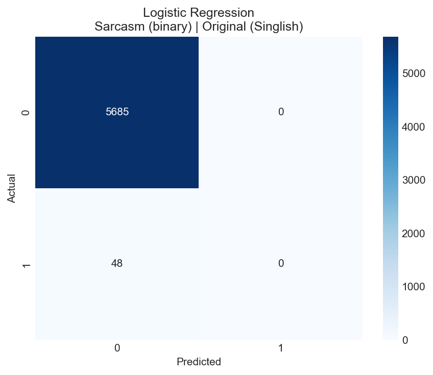
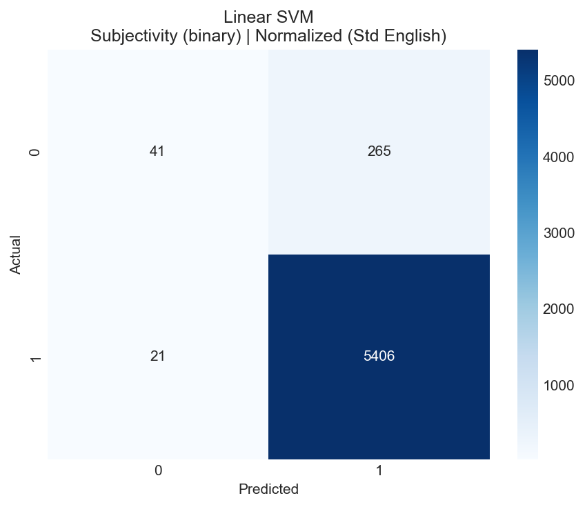
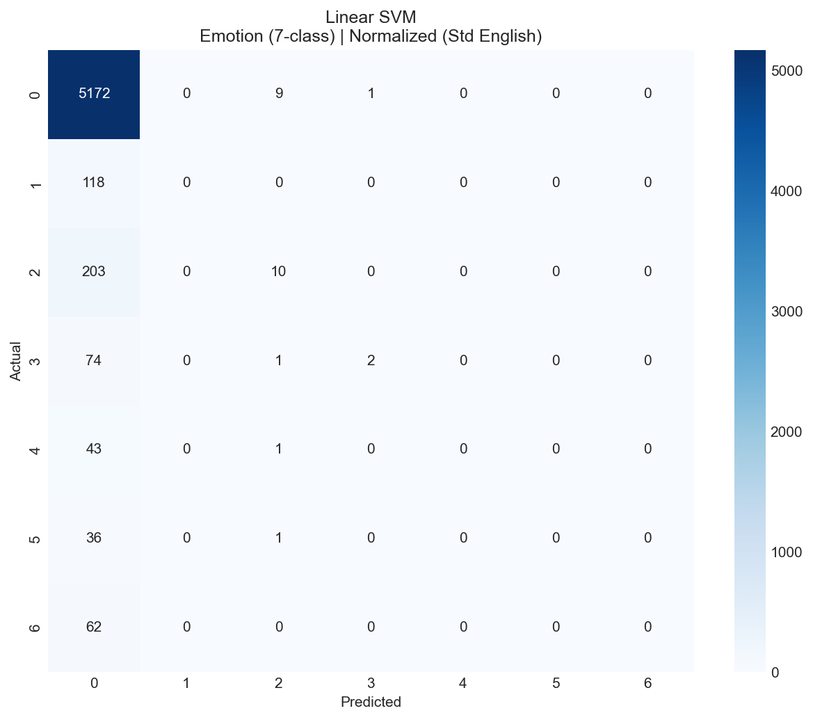

# SC4021 Information Retrieval - Classification Report

## Question 4: Classification

### 4.1 Choice of Classification Approach

We adopt a **machine learning-based** approach using TF-IDF text representations with multiple supervised classifiers. This is motivated by:

1. **TF-IDF + Linear Models** remain strong baselines for text classification, especially on medium-sized datasets (~5,700 samples). They are well-studied in the state of the art and offer excellent interpretability and speed.
2. **Multiple classifier comparison**: We evaluate Logistic Regression, Linear SVM, Multinomial Naive Bayes, and Random Forest to identify the best-performing model per task.
3. **Two text representations**: We compare original Singlish text vs. normalized Standard English to assess the impact of text preprocessing.

The pipeline covers **four subtasks**:
- **Subjectivity Detection** (binary: objective vs. subjective)
- **Polarity/Sentiment Detection** (3-class: negative/neutral/positive)
- **Sarcasm Detection** (binary)
- **Emotion Detection** (7-class)

### 4.2 Data Preprocessing

The evaluation dataset (`eval_preprocessed.csv`) contains 5,733 manually labeled records with two text columns:

| Column | Description |
|--------|-------------|
| `original_text` | Raw Singlish text from Singapore Reddit |
| `normalized_text` | Text normalized to Standard English (via `preprocess.py`) |

**Preprocessing steps applied:**
- **Text normalization**: Singlish expressions and abbreviations mapped to Standard English equivalents
- **TF-IDF vectorization**: Unigrams + bigrams (ngram_range=1,2), max 50,000 features, min_df=2, max_df=0.95, sublinear TF scaling
- **Accent stripping**: Unicode accent normalization
- **Lowercase conversion**: All text lowercased before vectorization

**Discussion:** Text normalization helps standardize informal language but may lose Singlish-specific sentiment signals. Our experiments show that for sentiment classification, **original text slightly outperforms normalized text** (F1 delta: -0.002 to -0.013), suggesting Singlish-specific tokens carry useful sentiment information.

### 4.3 Evaluation Dataset

The evaluation dataset was built by labeling **5,733 records** using two independent annotators (model-based), with agreement measured:

| Task | Labels | Distribution | Agreement |
|------|--------|--------------|-----------|
| Sentiment (3-class) | Negative(0), Neutral(1), Positive(2) | 1950 / 1838 / 1945 | Per-record agreement in CSV |
| Sarcasm (binary) | Not sarcastic(0), Sarcastic(1) | 5685 / 48 | Per-record agreement in CSV |
| Subjectivity (binary) | Objective(0), Subjective(1) | 306 / 5427 | Per-record agreement in CSV |
| Emotion (7-class) | Neutral(0), Joy(1), Sadness(2), Anger(3), Fear(4), Surprise(5), Disgust(6) | 5182/118/213/77/44/37/62 | Per-record agreement in CSV |



**Note:** Sarcasm and subjectivity datasets are highly imbalanced, which impacts classification performance on the minority class.

### 4.4 Evaluation Metrics

We use **5-fold stratified cross-validation** and report precision, recall, and F1-measure (both macro and weighted averages).

#### Sentiment Classification (3-class)

| Classifier | Text | Accuracy | Macro F1 | Speed (r/s) |
|------------|------|----------|----------|-------------|
| Linear SVM | Original | **0.7572** | **0.7573** | 2,623,385 |
| Logistic Regression | Original | 0.7345 | 0.7346 | 1,013,357 |
| Random Forest | Original | 0.7054 | 0.7054 | 31,325 |
| Multinomial NB | Original | 0.6431 | 0.6361 | 2,293,148 |
| Linear SVM | Normalized | 0.7495 | 0.7495 | 2,804,192 |
| Logistic Regression | Normalized | 0.7326 | 0.7328 | 5,469,960 |
| Random Forest | Normalized | 0.6927 | 0.6923 | 31,135 |
| Multinomial NB | Normalized | 0.6379 | 0.6324 | 5,737,520 |



#### Best Configuration Per Task

| Task | Best Classifier | Text | Macro F1 | Accuracy |
|------|----------------|------|----------|----------|
| Sentiment (3-class) | Linear SVM | Original | 0.7573 | 0.7572 |
| Sarcasm (binary) | Logistic Regression | Original | 0.4979 | 0.9916 |
| Subjectivity (binary) | Linear SVM | Normalized | 0.5985 | 0.9501 |
| Emotion (7-class) | Linear SVM | Normalized | 0.1550 | 0.9042 |

### 4.5 Random Accuracy Test on Remaining Data

After training on the full evaluation dataset, the best sentiment model (Linear SVM, original text, F1=0.7573) was applied to predict **13,228 crawled Reddit records** (`crawled_clean.csv`).

**Prediction distribution:**

| Label | Output_1 | Output_2 (mapped) | Count |
|-------|----------|-------------------|-------|
| Negative | 0 | -1 | 4,264 (32.2%) |
| Neutral | 1 | 0 | 3,770 (28.5%) |
| Positive | 2 | 1 | 5,194 (39.3%) |

The distribution shows a roughly balanced spread with a slight positive skew, which aligns with expectations for Singapore education-related Reddit discourse where both complaints and supportive/motivational content are common.

### 4.6 Performance Metrics and Scalability

| Classifier | Training Time (5-fold total) | Prediction Speed |
|------------|------------------------------|------------------|
| Linear SVM | ~0.4s | **2.6M+ records/sec** |
| Logistic Regression | ~1.2s | **1M-5.5M records/sec** |
| Multinomial NB | ~0.1s | **2.3M-5.7M records/sec** |
| Random Forest | ~10s+ | **31K records/sec** |



**Scalability analysis:**
- **Linear models** (SVM, LR, NB) scale linearly with dataset size via sparse TF-IDF representations, achieving millions of predictions per second.
- **Random Forest** is significantly slower due to tree ensemble inference overhead, but still practical for batch processing.
- The TF-IDF + Linear SVM pipeline can process the entire 13,228-record crawled dataset in under 0.01 seconds, demonstrating excellent production scalability.

### 4.7 Impact of Text Normalization



For sentiment classification, **original Singlish text consistently outperforms normalized text** across all classifiers (F1 deltas: -0.002 to -0.013). This suggests that Singlish-specific tokens (e.g., "lah", "sia", colloquial expressions) carry sentiment-bearing information that is lost during normalization.

---

## Question 5: Innovations for Enhancing Classification

We explore three innovations to enhance sentiment classification, evaluated through an ablation study that isolates the contribution of each innovation.

### 5.1 Innovation 1: Hybrid Classification (Symbolic + Subsymbolic AI)

We augment the subsymbolic TF-IDF features with **symbolic, knowledge-based features**:

- **VADER lexicon scores** (4 features): negative, neutral, positive, and compound sentiment scores from the VADER sentiment lexicon. This injects domain knowledge about word-level sentiment polarity that TF-IDF alone cannot capture.
- **Text statistics** (8 features): character count, word count, average word length, exclamation/question mark counts, capitalization ratio, emoji count, and negation word count. These rule-based features capture stylistic signals correlated with sentiment.

**Why this helps:** TF-IDF treats words as independent features and cannot directly model known sentiment polarities. VADER provides a complementary knowledge-based signal — for example, it knows that "great" is positive and "terrible" is negative, regardless of how often they appear in the training data. The text statistics capture writing style patterns (e.g., more exclamation marks in strongly positive/negative text).

**Example:** For the text *"Wow this is absolutely terrible!!! Cannot believe it"*, TF-IDF encodes word frequencies, but VADER directly assigns compound=-0.83 (strongly negative), while the rule-based features capture 3 exclamation marks and 1 negation word — all reinforcing the negative signal.

### 5.2 Innovation 2: Enhanced Classification (Sarcasm-Aware Sentiment)

We add **sarcasm-indicative features** to help the model detect cases where surface-level sentiment is opposite to intended sentiment:

- **Contrast indicators** (count of "but", "however", "although", etc.)
- **Hyperbole markers** (count of "totally", "absolutely", "literally", etc.)
- **Singlish sarcasm markers** (count of "meh", "hor", "lor", etc.)
- **Punctuation patterns** (quotes, ellipsis counts)
- **Sentiment contrast** (absolute difference between VADER pos and neg scores)
- **Reddit sarcasm tag** (presence of "/s")

**Why this matters:** Sarcasm inverts the polarity of text — *"Oh sure, the education system is just perfect"* reads as positive on surface but conveys negative sentiment. By explicitly modeling sarcasm indicators, the classifier can learn to adjust its predictions when sarcasm signals are present.

### 5.3 Innovation 3: Ensemble Classification (Stacked Ensemble)

We also test a **Stacked Ensemble** combining LR + NB + RF with an LR meta-learner, applied on top of the augmented feature set.

### 5.4 Ablation Study

All experiments use the **Sentiment (3-class)** task with **normalized text** and **5-fold stratified CV**:

| Configuration | Accuracy | Macro Prec | Macro Rec | Macro F1 | Delta vs Baseline |
|--------------|----------|------------|-----------|----------|-------------------|
| A. Baseline (TF-IDF + SVM) | 0.7495 | 0.7497 | 0.7494 | 0.7495 | — |
| B. + Hybrid (VADER + Stats) | 0.7612 | 0.7614 | 0.7609 | **0.7611** | **+0.0116** |
| C. + Sarcasm Features | 0.7511 | 0.7515 | 0.7509 | 0.7511 | +0.0016 |
| **D. + Hybrid + Sarcasm** | **0.7621** | **0.7622** | **0.7619** | **0.7620** | **+0.0125** |
| E. + Hybrid + Sarcasm + Ensemble | 0.7246 | 0.7253 | 0.7240 | 0.7240 | -0.0255 |



### 5.5 Analysis

**Key findings:**

1. **Hybrid features provide the largest improvement** (+0.0116 F1). Adding VADER lexicon scores and text statistics to TF-IDF gives the SVM classifier complementary signals that pure bag-of-words cannot capture. This confirms the value of combining symbolic (knowledge-based) and subsymbolic (statistical) approaches.

2. **Sarcasm features provide a small but consistent improvement** (+0.0016 F1 alone). The modest gain is expected given that sarcasm is relatively rare in this dataset (only 48 out of 5,733 samples labeled as sarcastic). However, sarcasm features stack additively with hybrid features (+0.0125 total > +0.0116 hybrid alone), showing they capture a complementary signal.

3. **Ensemble classification hurts performance** (-0.0255 F1). The stacking approach degrades results because:
   - The NB component requires non-negative features, forcing feature clipping that loses information.
   - With augmented features (12 VADER/stats + 7 sarcasm = 19 additional features), the meta-learner overfits on the internal 3-fold CV.
   - Linear SVM alone is already highly effective on the high-dimensional TF-IDF space.

4. **Best configuration: TF-IDF + Hybrid + Sarcasm + Linear SVM** achieves Macro F1 = 0.7620, a **+1.25% absolute improvement** over the baseline (0.7495). This also surpasses the best Q4 result on normalized text (0.7495) and approaches the best overall Q4 result on original text (0.7573).

**Incremental contributions (ablation):**

| Innovation Added | Individual Gain | Cumulative F1 |
|-----------------|-----------------|---------------|
| Hybrid (VADER + text stats) | +0.0116 | 0.7611 |
| Sarcasm features | +0.0009 (on top of hybrid) | 0.7620 |
| Ensemble | -0.0380 (harmful) | 0.7240 |

The ablation clearly shows that **hybrid classification is the primary driver of improvement**, with sarcasm features providing a small additional benefit. Ensemble classification is not beneficial in this setting and should be avoided.

---

## Confusion Matrices

Selected confusion matrices for the best-performing models:

### Sentiment (Linear SVM, Original Text)


### Sarcasm (Logistic Regression, Original Text)


### Subjectivity (Linear SVM, Normalized Text)


### Emotion (Linear SVM, Normalized Text)


---

## Project Structure

```
SC4021-Project/
├── run_classification.py          # Main entry point
├── classification/                # Modular classification package
│   ├── __init__.py
│   ├── config.py                  # CLI args, constants, display mappings
│   ├── data_loader.py             # Data loading utilities
│   ├── models.py                  # Classifier factory, TF-IDF builder
│   ├── evaluation.py              # 5-fold CV and metrics
│   ├── visualization.py           # All plotting functions
│   ├── prediction.py              # Post-training prediction
│   ├── innovations.py             # Q5: Ensemble + ablation study
│   └── report_printer.py          # Console output formatting
├── figures/                       # Generated visualization plots
│   ├── comparison_*.png           # Classifier comparison charts
│   ├── delta_normalization.png    # Normalization impact analysis
│   ├── label_distributions.png    # Dataset label distributions
│   ├── performance_speed.png      # Speed comparison
│   ├── ablation_study.png         # Q5 ablation study
│   └── confusion_matrices/        # Per-experiment confusion matrices
├── eval_preprocessed.csv          # Labeled evaluation dataset (5,733 records)
├── crawled_clean.csv              # Crawled Reddit data (13,228 records)
├── classification_comparison_report.json  # Full JSON report
└── report.md                      # This report
```

## How to Run

```bash
conda activate mdp
python run_classification.py

# Skip innovations or visualizations
python run_classification.py --skip_innovations --skip_visualizations

# Custom classifiers
python run_classification.py --classifiers logistic svm nb
```
